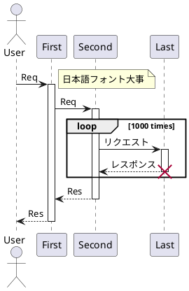

# Bridge PlantUML 

## Sequence Diagram

### BEFORE



## AFTER

### sequence_blue

```plantuml
@startuml
!include inc/sequence_blue.inc

actor User
participant "First" as A
participant "Second" as B
participant "Last" as C

User -> A: Req
activate A

note right: 日本語フォント大事
A -> B: Req
activate B

loop 1000 times
B -> C: リクエスト
activate C
C --> B: レスポンス
destroy C
end

B --> A: Res
deactivate B

A --> User: Res
deactivate A

@enduml
```

### sequence_green

```plantuml
@startuml
!include inc/sequence_green.inc

actor User
participant "First" as A
participant "Second" as B
participant "Last" as C

User -> A: Req
activate A

note right: 日本語フォント大事
A -> B: Req
activate B

loop 1000 times
B -> C: リクエスト
activate C
C --> B: レスポンス
destroy C
end

B --> A: Res
deactivate B

A --> User: Res
deactivate A

@enduml
```
